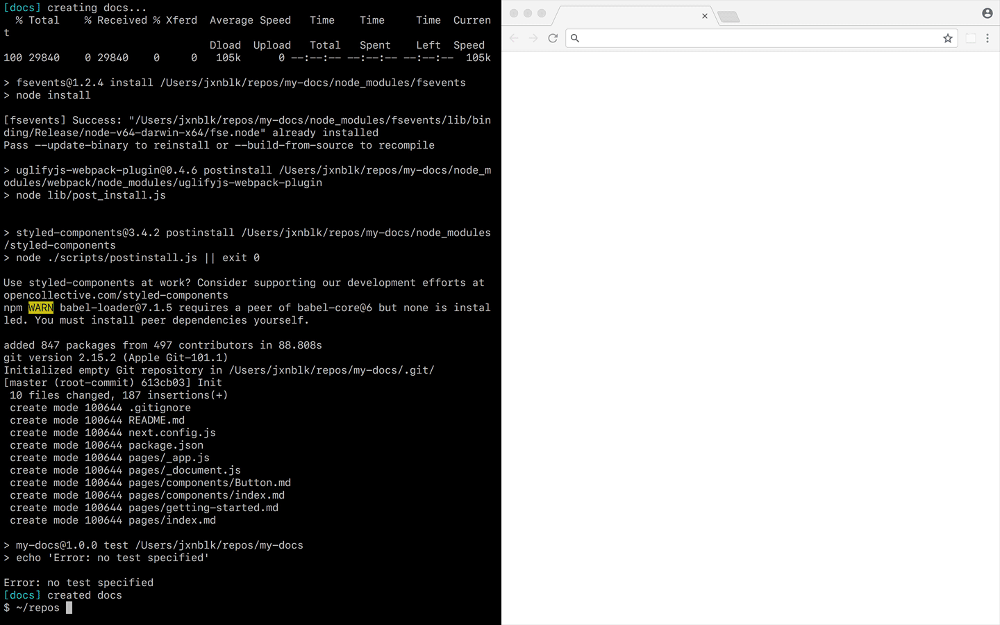

# MDX Docs

:memo: Document and develop React components with [MDX][] and [Next.js][]



https://jxnblk.com/mdx-docs/

```sh
npm init docs
```

- :memo: Create documentation with markdown
- :atom_symbol: Import and use React components
- :gear: Component-based API
- :computer: Live code examples
- :nail_care: Customizable themes
- ▲ Built for Next.js

## Getting Started

To create a new documentation site, run `npm init docs` and follow the prompts.
Once the application has been generated, see the [README.md](create-docs/templates/next/README.md)
for more documentation.

To add MDX Docs to an existing Next.js app, see the [Custom Setup](docs/pages/custom-setup.md) docs.

## Using MDX

MDX lets you mix markdown with inline JSX to render React components.
Write markdown as you normally would and use ES import syntax to use custom components in your document.

```mdx
import { Box } from 'grid-styled'

# Hello MDX!

<Box
  p={3}
  bg='tomato'>
  This will render as a component
</Box>
```

## Live Code

MDX Docs has built-in components to render JSX fenced code blocks as live previews with editable code, powered by [react-live][].
To make a code block render as an editable example, use the `.jsx` language attribute (note the `.` prefix).

````mdx
Live code example:

```.jsx
<button>Beep</button>
```
````

[react-live]: https://github.com/formidable/react-live

## Documentation

For further documentation see:

- [Components](docs/pages/components.md)
- [Theming](docs/pages/theming.md)
- [Custom Setup](docs/pages/custom-setup.md)

---

#### Prior Art

- [Compositor x0][]
- [mdx-deck][]
- [live-doc][]
- [Doctor Mark][]
- [docz][]

[Compositor x0]: https://compositor.io/x0
[live-doc]: https://github.com/jxnblk/live-doc
[Doctor Mark]: https://github.com/jxnblk/doctor-mark
[mdx-deck]: https://github.com/jxnblk/mdx-deck
[docz]: https://github.com/pedronauck/docz

[MDX]: https://github.com/mdx-js/mdx
[Next.js]: https://github.com/zeit/next.js/


[MIT License](LICENSE.md)
